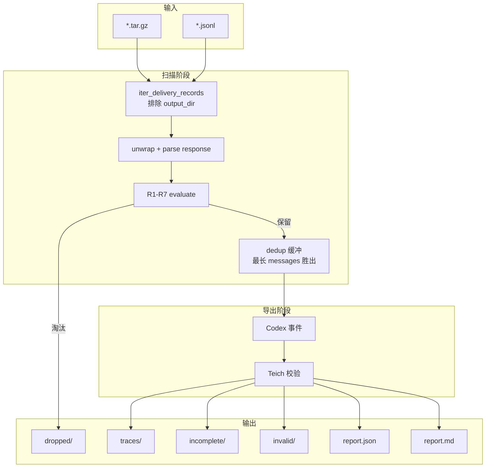

# Delivery Log → Teich Agent Trace — 使用手册

> **读者**：内部数据 / 运维团队——跑批、读报表、验收 trace。  
> **快速入门**：[README.md](README.md) · **开发与同步**：[MAINTAINER.md](MAINTAINER.md)

---

## 目录

1. [工具能做什么](#1-工具能做什么)
2. [流程概览](#2-流程概览)
3. [环境与依赖](#3-环境与依赖)
4. [命令行用法](#4-命令行用法)
5. [输入限制](#5-输入限制)
6. [输出与报表](#6-输出与报表)
7. [七条筛选规则（R1–R7）](#7-七条筛选规则r1r7)
8. [典型淘汰分布](#8-典型淘汰分布)
9. [验收清单](#9-验收清单)
10. [常见问题](#10-常见问题)
11. [退出码](#11-退出码)

---

## 1. 工具能做什么

处理 **GPT-5.5 等模型**的 delivery 日志（`*.tar.gz` / `*.jsonl`），输出 Teich 可直接消费的 **Codex 原生 trace JSONL**（每行一个事件：`session_meta`、`response_item` 等）。

**流水线**：解包信封 → R1–R7 筛选（默认）→ session 去重（默认，保留 messages 最长）→ Codex 事件导出 → Teich 校验 → `report.json` + `report.md`。

与「只筛选 API 日志、原样复制」不同：本工具额外完成 unwrap、Codex 转换与 Teich 验收。

---

## 2. 流程概览



默认 dedup 开启时，扫描阶段只缓冲、**扫描结束后才写 trace 文件**。调试 unwrap 中间态用 `--keep-unwrapped`（写入 `unwrapped/`）。

---

## 3. 环境与依赖

| 项目 | 要求 |
|------|------|
| Python | **3.10+** |
| 工作目录 | `powverse/trajery/` |
| teich | 默认**必须**安装；未安装时启动退出码 **3** |

```bash
cd powverse/trajery
pip install -e /path/to/teich
```

仅调试、无 teich 环境时可加 `--skip-teich-validate`（跳过校验，`teich_valid` 计数不代表真实可用）。

---

## 4. 命令行用法

```bash
python delivery_to_teich.py <input_dir> [<output_dir>] [选项...]
python delivery_to_teich.py --help
```

### 4.1 位置参数

| 参数 | 必填 | 说明 |
|------|------|------|
| `input_dir` | 是 | delivery 日志目录 |
| `output_dir` | 否 | 默认 `<input_dir>/output` |

### 4.2 选项

| 选项 | 默认 | 说明 |
|------|------|------|
| `--limit-files N` | 无 | 最多 N 个输入文件 |
| `--limit-records N` | 无 | 最多 N 条 delivery 记录 |
| `--no-filter` | off | 跳过 R1–R7 |
| `--no-dedup` | off | 跳过去重；每条保留记录单独导出 |
| `--no-dropped` | off | 不写 `dropped/`（报表仍统计） |
| `--keep-unwrapped` | off | 写 `unwrapped/` 中间产物 |
| `--emit-training-rows` | off | 写 `training_rows.jsonl` |
| `--report PATH` | `<output>/report.json` | JSON 报表路径 |
| `--report-md PATH` | `<output>/report.md` | Markdown 报表路径 |
| `--no-report` | off | 不写 JSON / Markdown 报表 |
| `--no-report-md` | off | 不写 Markdown 报表（仍写 JSON） |
| `--report-include-valid` | off | `report.json` 的 `teich_trace_results` 包含 valid 文件 |
| `--quiet` | off | 静默 |
| `--progress-every N` | `100` | 扫描心跳间隔；`0` 关闭 |
| `--clean-output` | off | 跑批前清空 `traces/`、`incomplete/`、`invalid/`、`dropped/`、`unwrapped/` |
| `--workers N` | `1` | scan 阶段并行 worker 数；`1`=串行（默认），`>1` 按 tar/jsonl 文件并行 |
| `--skip-teich-validate` | off | 跳过 Teich 校验（仅调试） |
| `--strict-empty` | off | `teich_valid==0` 时退出码 1 |

### 4.3 常用命令

```bash
python delivery_to_teich.py /path/to/delivery_log
python delivery_to_teich.py /path/to/delivery_log --no-dropped --emit-training-rows
python delivery_to_teich.py /path/to/delivery_log --limit-files 1 --limit-records 100
python delivery_to_teich.py /path/to/delivery_log --keep-unwrapped --limit-records 20
python delivery_to_teich.py /path/to/delivery_log --clean-output
python delivery_to_teich.py /path/to/delivery_log --workers 8
```

### 4.4 独立多平台 filter CLI

`filter_traj_multi_plat.py` 处理 **原始 API 日志**（默认 `*.json`），不执行 delivery 解包或 Teich 导出：

```bash
python filter_traj_multi_plat.py <input_dir> [<output_dir>] \
    [--dedup-mode stats|full|off] [--strict-empty] [--quiet]
```

| `--dedup-mode` | 行为 |
|----------------|------|
| `stats`（默认） | 只统计 session 重复，不删除记录 |
| `full` | 与主流水线相同：最长 messages 胜出 |
| `off` | 不算 session_id |

主流水线等价于始终 `dedup-mode=full`（可用 `--no-dedup` 关闭）。

---

## 5. 输入限制

| 限制 | 说明 |
|------|------|
| **tar.gz 单成员** | 每个 `.tar.gz` 只读取**第一个** `.jsonl` 成员；多成员时在日志与报表 `tar_warnings` 中告警 |
| **dedup 内存** | 默认在内存中缓冲每个 session 的最长快照；超大目录需注意内存 |
| **并行 scan** | `--workers > 1` 时按源文件并行；机械硬盘建议 `2~4`，NVMe 可用 CPU 核心数；`--limit-records` 时强制串行 |
| **时间戳** | Codex 事件使用**导出时 UTC**，非 delivery 原始时间戳 |
| **R5 与 delivery** | 顶层 `stop_reason` 常为空；是否通过 R5 以 `extract()` 结果为准 |

---

## 6. 输出与报表

### 6.1 输出目录

```text
<output_dir>/
    traces/              ← Teich 完整 Codex trace（验收看这里）
    incomplete/          ← 转换成功但 trace 不完整
    invalid/             ← Teich 转换失败
    dropped/             ← R1–R7 或 dedup 淘汰（--no-dropped 时不写）
    unwrapped/           ← --keep-unwrapped
    training_rows.jsonl  ← --emit-training-rows
    report.json          ← 机器可读统计（默认）
    report.md            ← 人类可读摘要（默认）
```

#### Teich 校验三分流

| 结果 | 条件 | 输出目录 |
|------|------|----------|
| **valid** | 转换成功且 `trace_is_complete=True` | `traces/` |
| **incomplete** | 转换成功但 `trace_is_complete=False` | `incomplete/` |
| **invalid** | 转换失败（`ok=False`） | `invalid/` |

**`trace_is_complete` 判定**：在 `assistant` / `model` / `tool` 消息中，末条 relevant role **不能是 `tool`**。即对话不能在「工具返回后、尚无最终 assistant 回复」处结束。

未安装 teich 时默认**启动即退出**；加 `--skip-teich-validate` 才跳过校验。

### 6.2 `report.json` 字段

| 字段 | 含义 |
|------|------|
| `elapsed_seconds` | 总耗时（秒） |
| `export_total` | 进入 Teich 校验的 trace 数（valid + incomplete + invalid） |
| `funnel` | Teich 校验转化率：`teich_valid_rate` 等 |
| `teich_trace_results` | 逐条 Teich 校验明细（默认仅 incomplete/invalid） |
| `valid_files_omitted` | 未写入 `teich_trace_results` 的 valid 条数 |
| `scanned` | 扫描行数 |
| `parse_errors` | 解析 / unwrap 失败总数 |
| `json_line_errors` | JSON 行非法（非 dict） |
| `unwrap_failures` | 失败分类：`request_not_string`、`response_parse_error` 等 |
| `tar_archives_with_multiple_jsonl` | 含多个 `.jsonl` 成员的 tar 数量 |
| `tar_skipped_jsonl_members` | 被跳过的 tar 内成员总数 |
| `tar_warnings` | 多成员 tar 明细 |
| `unwrapped` | unwrap 成功 |
| `filter_kept` / `filter_dropped` | R1–R7 通过 / 淘汰 |
| `dedup_dropped` | 去重淘汰 |
| `teich_valid` | **最终可用 trace 数** |
| `teich_incomplete` / `teich_invalid` | 不完整 / 无效 |
| `drop_reasons` | 淘汰原因计数 |
| `teich_errors` | Teich 错误计数 |

`teich_trace_results` 每项：`filename`、`session_key`、`status`、`error`、`trace_type`、`messages_count`、`tools_count`、`last_relevant_role`。

### 6.3 `report.md`

默认与 `report.json` 同目录生成（可用 `--no-report-md` 跳过），包含：

- 运行信息与验收 checklist
- 漏斗表（scanned → export → valid/incomplete/invalid）
- `drop_reasons` 表（含中文说明）
- incomplete / invalid **逐文件清单**（含 `last_relevant_role` 等诊断字段）
- tar 告警与 unwrap 失败（若有）

适合跑批后快速审阅；程序化消费用 `report.json`。

### 6.4 指标关系

```text
scanned
  ├─ parse_errors
  └─ unwrapped
       ├─ filter_dropped
       └─ filter_kept
            ├─ dedup_dropped
            └─ 进入导出 (export_total)
                 ├─ teich_valid      → traces/
                 ├─ teich_incomplete → incomplete/
                 └─ teich_invalid    → invalid/
```

**验收优先看 `teich_valid`**。`filter_kept` 通常大于 `teich_valid`（去重 + incomplete 会缩小最终数量）。

---

## 7. 七条筛选规则（R1–R7）

每条记录**评估全部规则**；失败时 `drop_reasons` 列出**所有**原因（不只第一条）。

| 规则 | 说明 | 典型 `drop_reason` |
|------|------|-------------------|
| **R1** 模型范围 | Claude Opus **4.5+**；或 GPT-5 系列（**排除** mini / nano） | `model_not_target_family` |
| **R2** 有工具定义 | `tools` / `functions` 非空 | `no_tools` |
| **R3** 足够长 | `messages` 数量 **严格 > 5** | `messages_le_5` |
| **R4** 有工具调用 | 至少一处 assistant 实际发起工具调用 | `no_assistant_tool_call` |
| **R5** 自然收尾 | 响应正常结束 | `stop_reason_tool_calls`、`stop_reason_length`、`stop_reason_missing` 等 |
| **R6** 有 system prompt | 非空 `instructions` / system / developer | `no_system_prompt` |
| **R7** 非心跳流量 | 排除 `[SILENT]`、OpenClaw 心跳探活等 | `silent_keepalive_marker`、`heartbeat_non_task_traffic` |

### 7.1 R1 接受的模型 ID

**Anthropic Claude Opus**

- ✅ `opus-4.5` 及更高（4.6、4.7…）
- ❌ `opus-3-x`、`opus-4`、`opus-4.1`、`opus-4.4`

**OpenAI GPT-5**

- ✅ `gpt-5`、`gpt-5.5`、`gpt-5-chat`、`gpt-5-codex`、`gpt-5-pro` 及带日期的 snapshot
- ❌ `gpt-5-mini`、`gpt-5-nano`、`gpt-4-*`、`gpt-4o`

脚本识别常见路由前缀（`openrouter/openai/gpt-5.5` 等）。

### 7.2 R5 与 openai_responses

对 `openai_responses` 格式，**可接受的 stop_reason 仅为 `stop`**（对应 Responses `status: completed` 且末项不是 function_call）。

若最后一轮输出停在 `function_call`（Agent 尚未继续），`extract()` 得到 `stop_reason=tool_calls` → R5 淘汰 → 原因 **`stop_reason_tool_calls`**。

这在 gpt-5.5 delivery 样本中**占淘汰大多数**，属预期现象（多轮快照截断在工具调用）。

> **注意**：R5 与 Teich `trace_is_complete` 是两层标准（见 [§6.1](#61-输出目录)、[FAQ](#10-常见问题)）。通过 R5 的记录仍可能 export 后被判 incomplete。

### 7.3 R7 心跳检测摘要

- 任意消息含 `[SLIENT]` / `[SILENT]` → 整段丢弃
- OpenClaw / EvoMap 心跳：user 通道含 `[openclaw heartbeat poll]` 等指纹，且 assistant 回复为 `HEARTBEAT_OK` 类字符串

---

## 8. 典型淘汰分布

gpt-5.5 delivery 参考（详见 `report.json` / `report.md` 的 `drop_reasons`）：

| drop_reason | 含义 |
|-------------|------|
| `stop_reason_tool_calls` | 截断在工具调用（R5），最常见 |
| `messages_le_5` | 对话过短（R3） |
| `no_assistant_tool_call` | 无工具调用（R4） |
| `no_tools` | 无工具定义（R2） |
| `no_system_prompt` | 无 instructions（R6） |
| `session_id_duplicate` | 去重淘汰（非 R1–R7） |

---

## 9. 验收清单

- [ ] `parse_errors == 0`（或 `unwrap_failures` 已记录原因）
- [ ] `teich_valid > 0`
- [ ] `drop_reasons` 分布符合预期（大量 `stop_reason_tool_calls` 通常正常）
- [ ] 抽查 `traces/*.jsonl` 首行含 `session_meta`，Teich 可 `convert_trace_to_training_example`
- [ ] 归档 `report.json`、`report.md` 与脚本版本
- [ ] 重复跑批：建议 `--clean-output`；`output/` 已自动排除扫描
- [ ] 若有 incomplete：查阅 `report.md` 逐文件清单，确认 `last_relevant_role` 多为 `tool`

---

## 10. 常见问题

**Q：`filter_kept` 为何远大于 `teich_valid`？**  
A：同一 session 多条快照经 dedup 合并；且 incomplete trace 不进 `traces/`。

**Q：为何有 incomplete？已通过 R5 为何还不完整？**  
A：R5 检查单条 delivery response 的 `stop_reason`；Teich `trace_is_complete` 检查**整段转换后 messages** 的末条 relevant role。能通过 R5 的记录，仍可能因 Codex 转换后的消息序列以 `tool` 结尾而 incomplete（例如 session 最长快照仍停在工具链中间）。详见 `report.md` 的 incomplete 表。

**Q：`teich_incomplete` 与 `teich_invalid` 区别？**  
A：incomplete = Teich 转换成功但对话未自然收尾（通常末条 role 为 `tool`）；invalid = 转换本身失败（trace_type 不对、转换异常等）。

**Q：重复运行会处理上次 output 吗？**  
A：不会。`output_dir` 在扫描时排除。同名 trace 覆盖写入；`--clean-output` 可清空输出子目录。

**Q：Teich 未安装？**  
A：默认启动 **fail-fast** 退出码 3。仅调试时加 `--skip-teich-validate`。

**Q：能否只改规则不改 delivery_to_teich？**  
A：可以。规则只在 `filter_traj_multi_plat.py`；主流水线通过 import 自动生效。改后运行 `python run_tests_against_vendor.py`（见 [MAINTAINER.md](MAINTAINER.md)）。

**Q：`--no-filter` 与 `--no-dedup`？**  
A：前者跳过 R1–R7；后者跳过去重。独立开关。

---

## 11. 退出码

| 码 | 含义 |
|----|------|
| 0 | 成功 |
| 1 | `--strict-empty` 且 `teich_valid == 0` |
| 2 | `input_dir` 无效 |
| 3 | 未安装 `teich` 且未传 `--skip-teich-validate` |

Teich 数据格式：[Teich 文档](https://github.com/TeichAI/teich)
